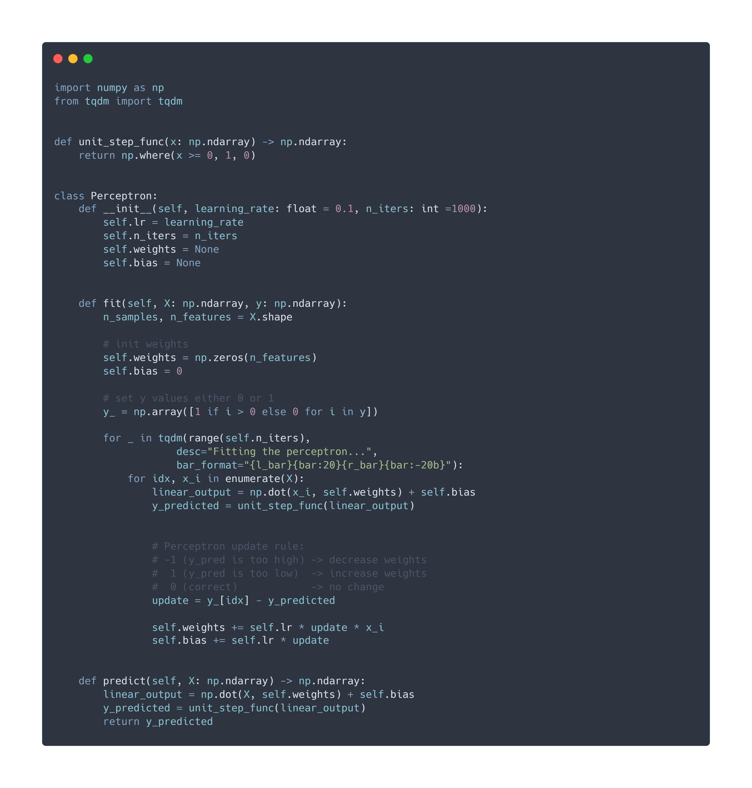
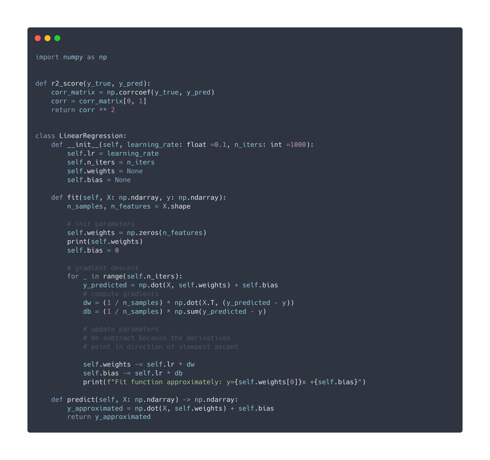
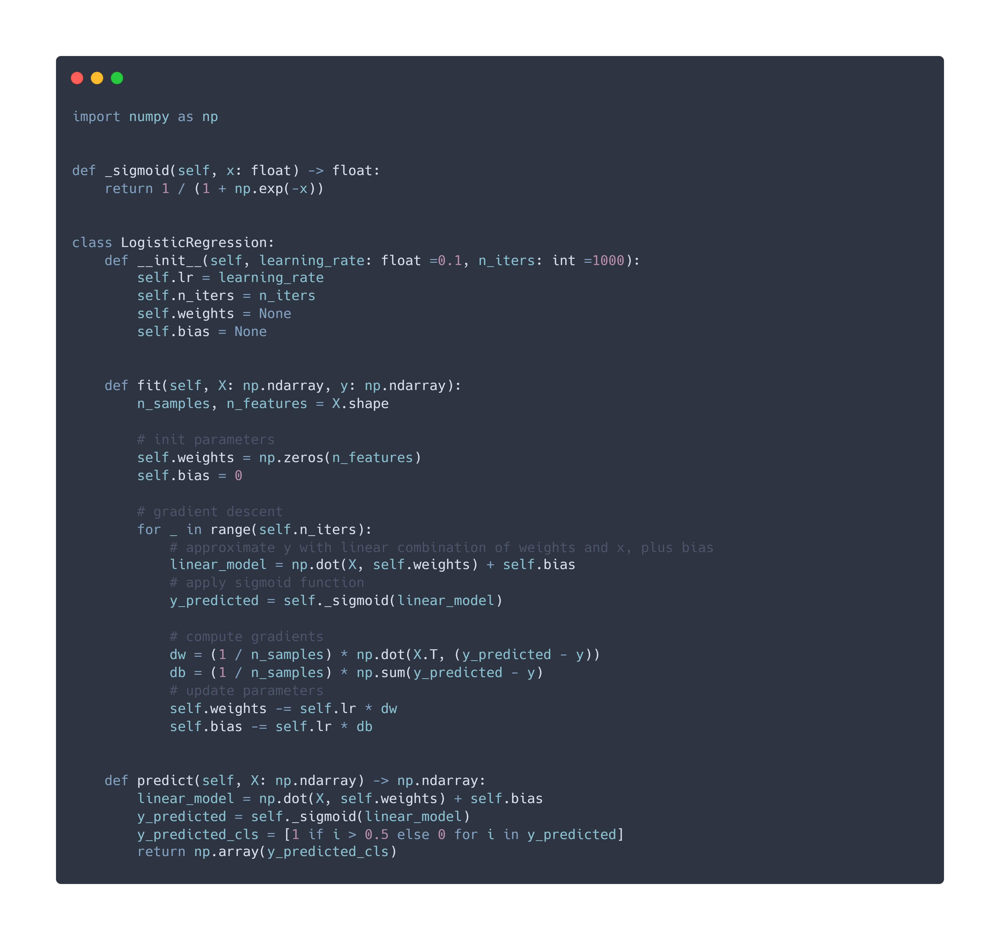

# Machine Learning algorithm implementations from scratch

## Algorithms Implemented

- KNN
- Linear Regression
- Logistic Regression
- Perceptron
- SVM
- PCA

## Perceptron
The perceptron can be used for supervised learning. It can solve binary linear classification problems. 

## Linear Regression

## Logistic Regression

